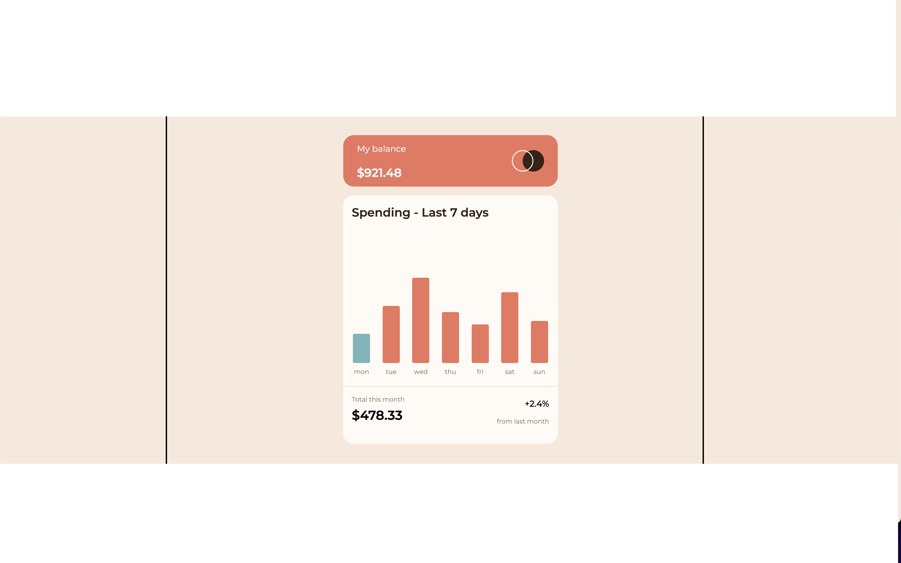

# Frontend Mentor - Expenses chart component solution

This is a solution to the [Expenses chart component challenge on Frontend Mentor](https://www.frontendmentor.io/challenges/expenses-chart-component-e7yJBUdjwt). Frontend Mentor challenges help you improve your coding skills by building realistic projects.

## Table of contents

- [Overview](#overview)
  - [The challenge](#the-challenge)
  - [Screenshot](#screenshot)
  - [Links](#links)
- [My process](#my-process)
  - [Built with](#built-with)
  - [What I learned](#what-i-learned)
  - [Continued development](#continued-development)
  - [Useful resources](#useful-resources)
- [Author](#author)

**Note: Delete this note and update the table of contents based on what sections you keep.**

## Overview

### The challenge

Users should be able to:

- View the bar chart and hover over the individual bars to see the correct amounts for each day
- See the current day’s bar highlighted in a different colour to the other bars
- View the optimal layout for the content depending on their device’s screen size
- See hover states for all interactive elements on the page
- **Bonus**: Use the JSON data file provided to dynamically size the bars on the chart

### Screenshot

### Links

- Solution URL: [Add solution URL here](https://your-solution-url.com)
- Live Site URL: [Add live site URL here](https://your-live-site-url.com)

## My process

I started with setting up the style for everyting before coding the logic and implementing the data.
Then some final touches to the look.

### Built with

- Semantic HTML5 markup
- CSS custom properties
- Flexbox
- Mobile-first workflow
- [React](https://reactjs.org/) - JS library
- [Styled Components](https://styled-components.com/) - For styles

### What I learned

I'm getting better with css and using correct html tags but still need to improve

I was happy with completing the bonus of dynamically sizing the chart

### Continued development

I want to get better in React and I also need to practice css grid before i can move on to some CSS frameworks.

### Useful resources

I google alot when developing and stackoverflow usually comes to the rescue.
https://css-tricks.com/snippets/css/a-guide-to-flexbox/ also always comes in handy when using flexbox.

## Author

- Website - [Add your name here](https://www.your-site.com)
- Frontend Mentor - [@stefansnaerh](https://www.frontendmentor.io/profile/stefansnaerh)
